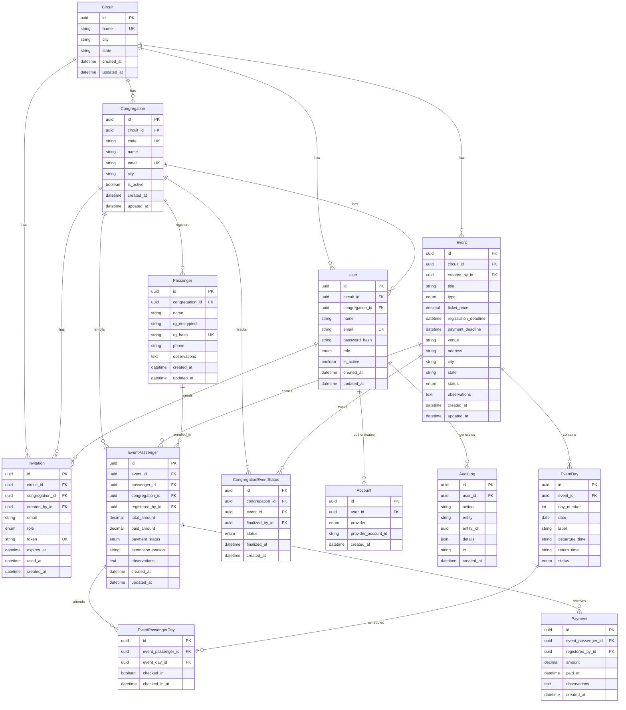

# SUOAC — Diagrama de Entidades e Relacionamentos

**Versão:** 2.0 | **Atualizado em:** 14/05/2026

> Para visualizar: abra no GitHub, GitLab ou VS Code com a extensão "Markdown Preview Mermaid Support".

## Resumo dos relacionamentos

- **Circuit** → raiz multi-tenant. Tudo pertence a um circuito.
- **Congregation** → pertence a um Circuit. Quantidade ilimitada.
- **User** → pertence a um Circuit, opcionalmente a uma Congregation (null para coordenadores do circuito).
- **Account** → providers de autenticação (LOCAL, GOOGLE) vinculados ao User.
- **Event** → criado pelo coordenador do circuito. Contém EventDays.
- **EventDay** → cada dia do evento (sexta, sábado, domingo).
- **Passenger** → cadastro base por congregação (nome + RG criptografado).
- **EventPassenger** → inscrição de um passageiro em um evento.
- **EventPassengerDay** → quais dias o passageiro vai (pivot entre EventPassenger e EventDay).
- **Payment** → registros individuais de pagamento (suporta parciais).
- **CongregationEventStatus** → se a congregação finalizou sua lista para o evento.
- **Invitation** → convites para novos usuários.
- **AuditLog** → registro de todas as ações no sistema.
